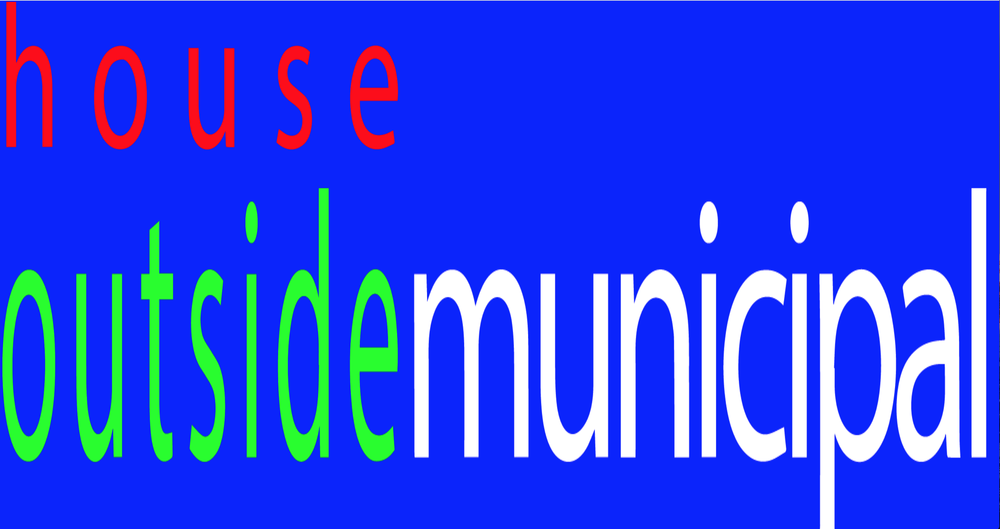

#movements#  
this website uses "mousemove" in Javascript to create an effect that alters four images ...  

See for yourself in your browser: 
https://0000magda0000.github.io/movements/
   

*this was done with the help of the superhi tutorial* https://www.superhi.com/video/barron-webster?utm_campaign=0319_vids_ints_v1&utm_medium=fb_inst_social&utm_source=fb_inst
